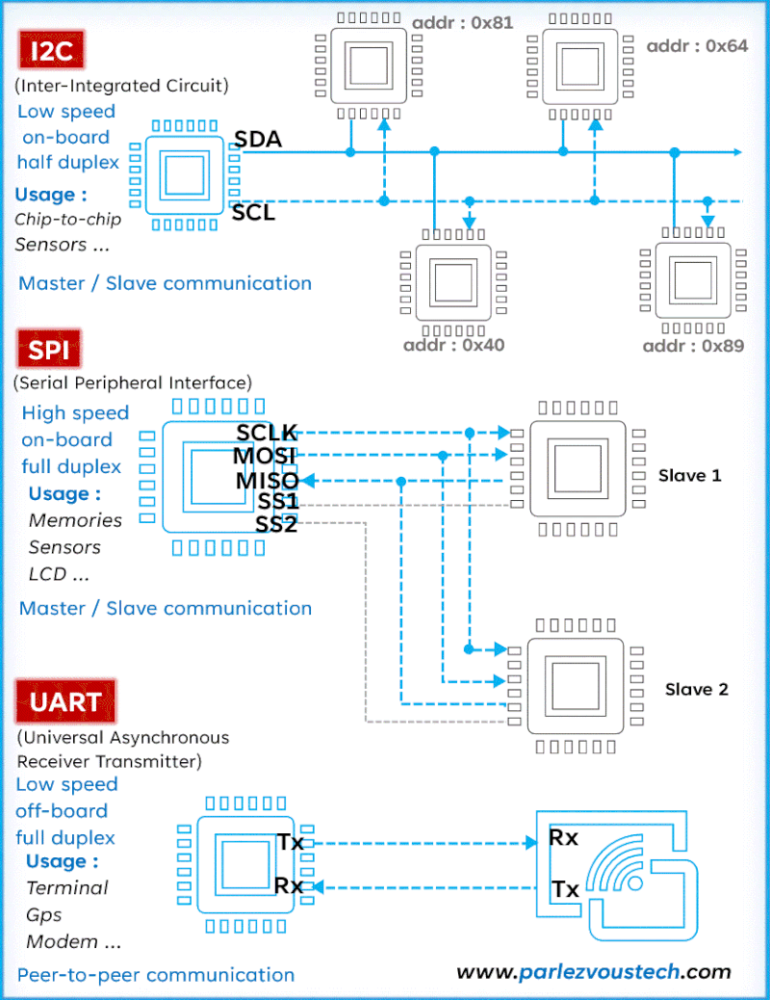

# Digital Communication Protocols

Project hiện thực ba giao thức giao tiếp số phổ biến **UART, SPI và I2C** bằng Verilog. Mỗi giao thức có mã nguồn RTL, testbench và Makefile riêng để mô phỏng và kiểm tra hoạt động truyền nhận dữ liệu.

Project phục vụ học tập và thực hành thiết kế phần cứng số, giúp tìm hiểu nguyên lý giao tiếp nối tiếp, xây dựng máy trạng thái (FSM) và kiểm chứng thiết kế RTL.

<p align="center">
  
</p>

## Các giao thức

- **UART:** truyền nhận dữ liệu nối tiếp bất đồng bộ, tích hợp bộ tạo baud và FIFO.
- **SPI:** thiết kế SPI Master Mode 0, hỗ trợ truyền nhận dữ liệu đồng thời.
- **I2C:** thiết kế I2C Master địa chỉ 7 bit, hỗ trợ đọc/ghi dữ liệu, ACK/NACK và clock stretching.

## Nguyên lý và thiết kế

### UART

UART là giao tiếp nối tiếp **bất đồng bộ**, sử dụng đường TX để phát và RX để nhận, không truyền clock giữa hai thiết bị. Hai bên cần thống nhất baud rate và định dạng khung dữ liệu. Start bit giúp bên nhận xác định thời điểm bắt đầu; stop bit đánh dấu kết thúc khung.

Thiết kế trong project sử dụng khung **8N1**: 8 bit dữ liệu, không parity và 1 stop bit. Dữ liệu được truyền từ bit thấp nhất (LSB) trước; đường truyền ở mức cao khi không có dữ liệu.

```text
Khung UART: Idle(1) → Start(0) → D0 … D7 → Stop(1)

Luồng TX: Dữ liệu → TX FIFO → uart_tx → TXD
Luồng RX: RXD → uart_rx → RX FIFO → Dữ liệu
```

Module `uart_top.v` kết nối bộ phát, bộ nhận và hai FIFO. `baud_gen.v` tạo tick để xác định thời gian mỗi bit; `uart_tx.v` điều khiển trình tự phát bằng FSM. `uart_rx.v` đồng bộ tín hiệu đầu vào, lấy mẫu 8 lần mỗi bit và dùng kết quả đa số của ba mẫu để quyết định giá trị bit. FIFO lưu tạm dữ liệu, giúp phần xử lý phía ngoài không phải đọc/ghi đúng thời điểm từng bit được truyền.

Testbench kiểm tra loopback TX–RX, truyền nhiều byte và phát hiện stop bit không hợp lệ. Thiết kế minh họa cách chuyển đổi dữ liệu song song sang nối tiếp và nhận lại dữ liệu khi không có clock chung.

### SPI

SPI là giao tiếp nối tiếp **đồng bộ**, trong đó master tạo clock SCK để điều khiển quá trình trao đổi dữ liệu. MOSI mang dữ liệu từ master tới slave, MISO mang dữ liệu theo chiều ngược lại và CS chọn slave tham gia giao dịch. Hai đường dữ liệu riêng cho phép truyền và nhận đồng thời.

Hai tham số CPOL và CPHA xác định mức clock khi nghỉ và cạnh lấy mẫu. Project sử dụng **Mode 0 (`CPOL=0`, `CPHA=0`)**: SCK nghỉ ở mức thấp, dữ liệu được lấy mẫu tại cạnh lên và thay đổi tại cạnh xuống.

```text
Master ── SCK, MOSI, CS ──→ Slave
Master ←───── MISO ─────── Slave

FSM: IDLE → START → TRANSFER → STOP
```

Module `master_spi.v` dùng bộ chia clock và hai thanh ghi dịch để gửi/nhận một byte, MSB trước. Khi có lệnh `start`, FSM chọn slave, tạo các cạnh SCK và trao đổi 8 bit. Kết thúc giao dịch, module nhả CS, cập nhật byte nhận và phát xung `done`. Tần số SCK được xác định bởi `f_sck = f_clk / (2 × CLK_DIV)`.

Testbench mô phỏng slave và đối chiếu dữ liệu ở cả hai chiều. Thiết kế tập trung vào việc phối hợp cạnh clock, thanh ghi dịch và tín hiệu chọn thiết bị.

### I2C

I2C là giao tiếp nối tiếp **đồng bộ**, dùng hai đường bus chung: SCL cho clock và SDA cho dữ liệu. Thiết bị được chọn bằng địa chỉ, giúp nhiều thiết bị có thể dùng chung bus. SCL và SDA hoạt động theo kiểu **open-drain**: thiết bị chỉ kéo đường bus xuống thấp hoặc nhả ra; điện trở pull-up đưa bus lên mức cao.

START được tạo khi SDA chuyển từ cao xuống thấp trong lúc SCL đang cao; STOP là chuyển đổi ngược lại. Sau mỗi byte, bên nhận phản hồi ở clock thứ 9: **ACK** bằng mức thấp hoặc **NACK** bằng mức cao. Clock stretching cho phép slave giữ SCL thấp để yêu cầu master chờ.

```text
Giao dịch một byte:
START → Địa chỉ 7 bit + R/W → ACK → Dữ liệu 8 bit → ACK/NACK → STOP
```

Module `i2c_master.v` dùng FSM để tạo START, gửi địa chỉ, đọc/ghi một byte và kết thúc bằng STOP. Bộ điều khiển chờ mức SCL thực tế khi slave kéo dài clock, giữ trạng thái lỗi NACK và kết thúc sớm nếu địa chỉ không được ACK. Với giao dịch đọc một byte, master gửi NACK sau byte nhận để báo kết thúc.

Testbench dùng pull-up và mô hình slave open-drain để kiểm tra dữ liệu, ACK/NACK, reset và clock stretching. Thiết kế minh họa cách điều khiển bus hai chiều, nhả đường dữ liệu cho bên còn lại và xử lý phản hồi trong giao dịch.

## Cấu trúc project

```text
digital-communication-protocols/
├── UART/       # RTL và testbench UART
├── SPI/        # RTL và testbench SPI Master
├── I2C/        # RTL và testbench I2C Master
└── README.md
```

## Công cụ

- **Ngôn ngữ:** Verilog / SystemVerilog.
- **Mô phỏng:** QuestaSim, ModelSim hoặc Icarus Verilog.
- **Tự động hóa:** Makefile hỗ trợ biên dịch, mô phỏng và tạo báo cáo coverage với simulator phù hợp.
